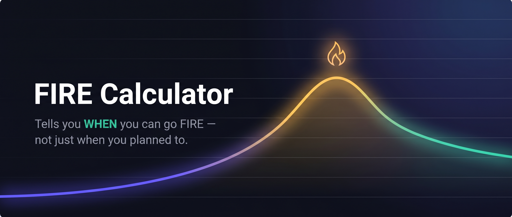
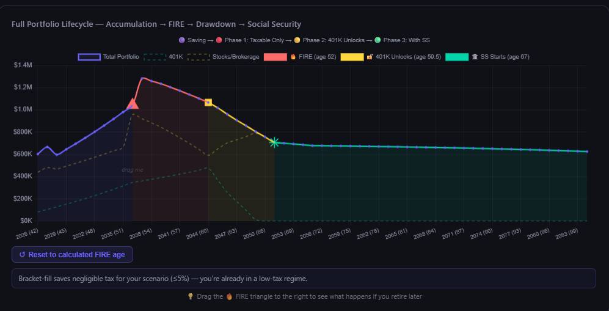
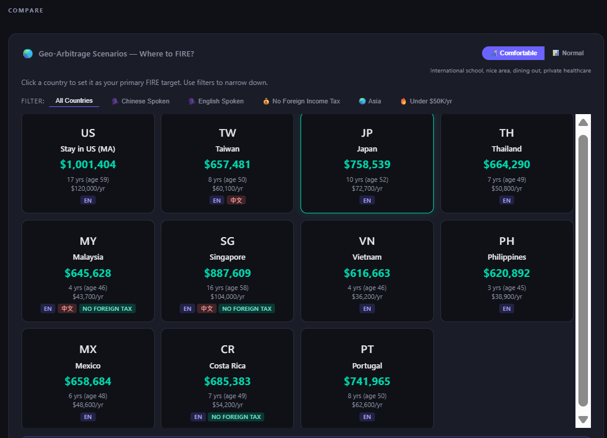

<p align="center">
  
</p>

# FIRE Calculator

> **Most FIRE planners ask you when you want to retire, then check if the numbers fit.**
> **This one does the opposite: it tells you when you can actually go.**

Drop in your real balances, your real income, your real spending. The dashboard solves for the earliest year you can leave your job and still have the plan survive — under three different "how aggressive do you feel" modes (Safe · Exact · Die-With-Zero), across twelve candidate retirement destinations, with a seven-strategy withdrawal optimizer that ranks each policy under your chosen objective ("leave more behind" or "pay less lifetime tax"). Drag the retirement age on the chart to see what happens if you leave a year earlier, or a year later. The whole thing runs in your browser. Nothing gets uploaded anywhere.

> **Who this is for:** someone who currently **lives and works in the United States** and is planning where (and when) to retire — staying put or using geo-arbitrage abroad. The math assumes US accounts and rules: federal + state income tax, 401(k) / Roth IRA / brokerage buckets, the age-59.5 withdrawal rule, Rule of 55, Social Security, IRMAA, RMDs at 73, and ACA healthcare costs pre-Medicare. The destination scenarios model relocating *out of* the US at retirement; they don't cover the reverse (e.g. a non-US resident planning to retire elsewhere without US retirement accounts).

---

## What makes this different

Most calculators treat FIRE as a single number: *"You'll be ready at 55."* This one shows you the shape of the thing:

- **Drag to ask "what if"** — Grab the FIRE marker on the Full Portfolio Lifecycle chart (or its pinnable sidebar mirror — both are draggable). Drop it on any age. Every chart, KPI, and status banner recomputes in the same frame so you can see exactly what retiring earlier or later costs you.
- **Three retirement postures** — **Safe** (per-year buffer floor across all three retirement phases + end-balance ≥ 20% of FIRE-balance, so the tail trends upward instead of grinding to $0), **Exact** (end with a chosen cushion in years-of-spend), **Die-With-Zero** (spend the last dollar the day you die — same trajectory floor as Safe; only the optimization target differs). Same math engine, three different feasibility constraints.
- **Bracket-fill tax smoothing** — Instead of drawing the 12% bracket in a concentrated 3-year burst then leaving headroom wasted, the tool fills the bracket every year and routes the excess into taxable brokerage. Honest about IRMAA, Rule of 55, and the 5-year Roth clock — every rule that changes your answer gets a visible indicator on the chart.
- **Multi-strategy withdrawal optimizer** — Seven withdrawal policies (Bracket-Fill Smoothed, Conventional, Proportional, Roth Ladder, Tax-Optimized Search, Trad-First, Trad-Last Preserve) scored against your active objective. Flip between "leave more behind" and "pay less lifetime tax" and the winner banner, compare panel, Lifetime Withdrawal chart, and full portfolio trajectory all re-render together. Infeasible strategies still previewable with a warning badge so you can see *why* they fail under your mode. Chart-consistent Safe/Exact/DWZ gate means "Safe" actually rejects strategies that drain to $0 and live on Social Security.
- **Per-year asset breakdown** — Hover any age on the Lifecycle chart and the tooltip shows every pool at that moment: Total · Trad 401K · Roth 401K · Stocks · Cash. A scrollable table beneath the chart lets you scan the whole 50-year trajectory; the FIRE-age row is highlighted.
- **Geo-arbitrage, real numbers** — Twelve countries, each with its own cost-of-living, visa cost, relocation cost, healthcare delta, and tax treatment. Switch between them without contaminating each card's FIRE number with the previous country's assumptions.
- **Transparent, not magical** — When a rule (Social Security taxable portion, IRMAA threshold, RMD after 73, Rule of 55 unlock, home sale at FIRE) affects a given year, the chart shows you. No black box.

---

## Quick start

Open **`FIRE-Dashboard-Generic.html`** directly in a browser, or serve locally:

```bash
# Windows — double-click the launcher (uses port 8766)
start-local-generic.cmd

# macOS / Linux
python -m http.server 8766
# then visit http://localhost:8766/FIRE-Dashboard-Generic.html
```

The dashboard has no dependencies beyond Chart.js (loaded from CDN). No `npm install`. No build step. No account. No accounts, ever.

---

## See it in action

**Full Portfolio Lifecycle** — accumulation, FIRE, drawdown, Social Security, all in one phase-colored curve. Drag the 🔥 marker to any retirement age and every chart, KPI, and banner updates in-frame.

<p align="center">
  
</p>

**Geo-Arbitrage Scenarios** — twelve candidate retirement destinations, each with its own cost of living, visa requirements, healthcare delta, and tax treatment. Filter by language, region, tax treatment, or spend tier to find where your money stretches furthest.

<p align="center">
  
</p>

---

## Features

- **Tabbed dashboard** — four themed tabs (Plan · Geography · Retirement · History) with sub-tab pills, plus an Audit tab. The KPI ribbon and the pinned Lifecycle sidebar stay visible across every tab so the headline numbers never disappear. Active view persists in `localStorage` and via URL hash (`#tab=…&pill=…`) for bookmarkable deep links.
- **Full Portfolio Lifecycle chart** — accumulation → FIRE → drawdown → Social Security, drawn as a single phase-colored curve. Draggable FIRE marker (on either the main chart **or** the pinnable sidebar mirror — both are wired up). Reflects the currently-displayed withdrawal strategy (winner or previewed) with mortgage / college / second-home overlays preserved. Hovering any year lists every pool: Total · Trad 401K · Roth 401K · Stocks · Cash.
- **Year-by-year asset breakdown table** — companion to the Lifecycle chart. Sticky-header scrollable table with Year · Age · Trad 401K · Roth 401K · Stocks · Cash · Total, FIRE-age row highlighted. Reads the same simulator the chart draws, so they're guaranteed consistent.
- **Lifetime Withdrawal Strategy chart** — per-year stacked bars showing Traditional 401K, Roth, taxable stocks (LTCG), and cash draws. Effective tax rate overlay. Rebuilds when you switch objective or preview a different strategy.
- **Strategy comparison panel** — table of the six non-winner strategies with end-of-plan balance, lifetime tax, earliest feasible FIRE age, and a Preview button (warning-styled for infeasible rows) that swaps every chart + banner to that strategy so you can see the trade-off visually.
- **Editable expense list** — ten seeded categories plus a `+ Add expense` picker that draws from a pre-translated library (Pets, Travel, Subscriptions, Hobbies, Donations, Personal Care, Gifts, Home Maintenance, Insurance, Phone, Gym) or a free-text custom name. Every row except the locked Rent / Housing row gets a remove button. Only the *sum* drives the FIRE math — adding/removing rows just reshapes the breakdown.
- **Payoff vs Invest pill** — read-only analysis on the Plan tab that visualizes whether prepaying the mortgage or investing the same extra cash leaves you wealthier year-by-year. Three charts (Wealth Trajectory, "Where each dollar goes" amortization split, Verdict mini) plus a Factor Breakdown card listing the dominant drivers (real-spread, time horizon, LTCG drag, mortgage years remaining, etc.) with directional arrows. Optional inputs for a planned mid-window refi (year + new rate + new term) and a state-MID effective-rate override slider. Every input is local to the pill — switching between strategies, toggling sliders, or enabling refi has zero effect on any other chart in the dashboard.
- **KPI row** — Net Worth, FIRE Number, Progress %, Years to FIRE.
- **Country comparison grid** — twelve destinations, each card ranked by its own FIRE number and years-to-FIRE, with visa + relocation + healthcare overlays.
- **Milestone timeline** — $500K, $1M, Coast FIRE, 401K unlock at 59.5, Social Security start, RMDs, per-scenario FIRE. Dollar-target milestones flip to "Already achieved!" the moment current net worth crosses the threshold, independent of projection quirks.
- **Mortgage + Second-home planning** — buy now, buy later, keep / sell / inherit at FIRE, rental income overlay. Loan term slider supports 15–40 years.
- **College planning** — per-kid cost estimates, loan-funding split, parent-PLUS modeling.
- **Healthcare delta** — per-country pre-65 and post-65 estimates with user overrides.
- **Audit tab** — shows the inputs, spending derivation, every Safe/Exact/DWZ gate's per-mode verdict with the actual formula, the FIRE-age search trace, the strategy ranking, the per-year lifecycle table, and any cross-validation warnings — so when a number surprises you, you can trace exactly where it came from.
- **Snapshot history** — save your numbers as a CSV row, track progress over time.
- **Bilingual** — English and Traditional Chinese (zh-TW), toggled at the top-right.
- **Dark theme**, responsive down to mobile, no framework.

---

## What's next

For the full picture of what's done, in-flight, and on the wishlist, see the master planning doc: [FIRE-Dashboard-Roadmap.md](./FIRE-Dashboard-Roadmap.md) and the active backlog: [BACKLOG.md](./BACKLOG.md).

---

## Privacy — genuinely

Everything runs locally. Your figures live in your browser's `localStorage` and your CSV snapshot file (if you choose to save one). Nothing gets sent to a server. There is no server. No analytics. No third-party scripts beyond Chart.js from CDN for rendering. If you open the file from your filesystem (`file://...`) it still works.

You can close the browser, copy the HTML file together with the `calc/` folder to an air-gapped machine, and it'll run there too.

---

## Tech

- Vanilla JavaScript (ES2020+). No build step, no transpiler, no bundler.
- Chart.js loaded from CDN. Zero other runtime dependencies.
- Mostly-single-file: `FIRE-Dashboard-Generic.html` plus a small `calc/` folder (tab routing, FIRE-age state machine, audit data, inflation helpers) loaded as classic `<script>` tags. Drop the HTML *and the `calc/` folder* together on any web host, or run from your filesystem. Moving the HTML alone (without `calc/`) will load but tab/pill clicks won't wire up.
- Spec-driven development via [GitHub spec-kit](https://github.com/github/spec-kit). Every feature ships with a spec, a plan, a task list, contracts, and a closeout in `specs/`.
- Tested via Node unit tests (`tests/unit/*.test.js`) + a browser smoke harness (`tests/baseline/browser-smoke.test.js`).

---

## Run the tests

```bash
node --test "tests/unit/*.test.js"
node tests/baseline/browser-smoke.test.js
```

Both should show all green.

---

## Project layout

```
FIRE-Dashboard-Generic.html     # the dashboard (load this in your browser)
calc/                           # required sidecars — must travel with the HTML
  ├── tabRouter.js              #   tab + pill navigation
  ├── chartState.js             #   FIRE-age single-source-of-truth + drag confirm
  ├── calcAudit.js              #   Audit tab data assembly
  └── inflation.js              #   inflation helpers
FIRE-snapshots.csv              # append-only snapshot history
specs/                          # feature specs + plans + tasks + closeouts
tests/                          # unit tests + browser smoke harness
docs/                           # README assets
```

---

## Contributing

This project is open source under MIT. It's maintained as a personal tool with a public mirror; external contributions are welcome via issues and PRs, but the scope is curated — features that don't fit the "runs in a browser, no server, tells you when you can go" philosophy may be declined with thanks.

---

## Disclaimer

⚠️ **For research and educational purposes only — not financial advice.**

Projections are estimates based on simplified models with assumed constant rates of return, inflation, and tax brackets. Past performance does not guarantee future results. Social Security estimates are approximate. Tax brackets, IRMAA thresholds, Medicare premiums, and other figures update annually; the tool's defaults reflect the year of its last release.

Do your own research (DYOR) and consult a qualified financial advisor before making financial decisions. The authors assume no responsibility for decisions made from this tool. All data you enter stays on your device — this site never saves, uploads, or transmits any of your information.

---

## License

[MIT](LICENSE). Use it, fork it, embed it in your own tool, ship your own variant. No attribution required but appreciated.
